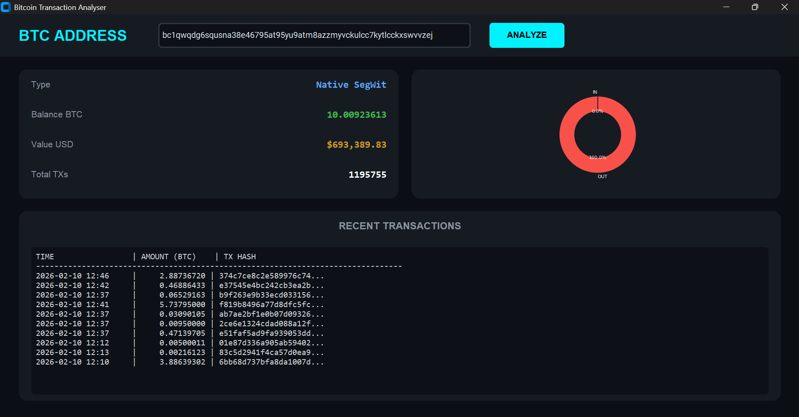

Bitcoin Wallet Analyzer

Bitcoin Wallet Analyzer is a Python-based graphical application developed for analyzing Bitcoin wallet addresses. The application provides a clear and user-friendly interface to monitor wallet activity and transaction details.

Features:

Display wallet balance in Bitcoin (BTC) and US Dollars (USD)

Pie chart visualization of transaction distribution

Detailed list of recent transactions

Installation:

To install the required dependencies, run the following command in your terminal:

pip install -r requirements.txt